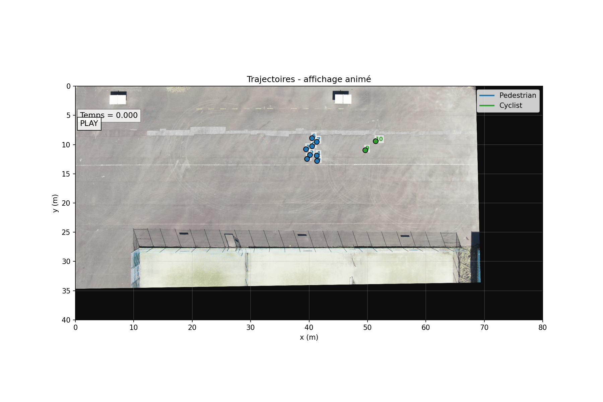
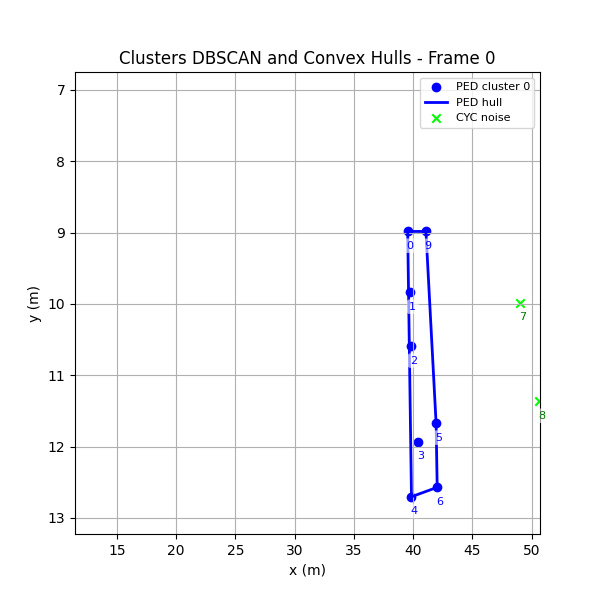

# Trajectories and Interactions Visualizer – Analyse des interactions piétons-cyclistes dans des espaces partagés

## Description du projet

Ce projet propose un outil Python de **visualisation et d’analyse de trajectoires d'usargers routiers**, avec un focus particulier sur les **interactions entre piétons et cyclistes**.

L’objectif est de :
- visualiser des trajectoires issues de différents jeux de données,
- filtrer les données pour isoler les interactions piétons-cyclistes dans des espaces partagés,
- analyser et **classifier les interactions selon des critères spatio-temporelles** entre piétons et cyclistes.

Ce code est conçu dans le cadre d'un stage M2 pour **l'analyse et la modélisation des interactions piétons-micormobilité dans les epsaces partagés**.

<p align="center">

|  |  |
|:----------------------------------:|:--------------------------------------------:|
| Visualisation des trajectoires d'une vidéo de CTV | Clusters DBSCAN et convex hull pour la vidéo de CTV |

</p>

<p align="center">
  
</p>


---

## Fonctionnalités principales

- Visualisation :
  - **statique** (trajectoires complètes)
  - **animée** (évolution dans le temps)

- Support de plusieurs jeux de données:
  - CTV: benchmark de référence avec des trejctoires et interactions multiples de piétons et cyclistes (Allemagne).
  - Trajectory Shared Space (TSS): trajectoires de piétons, cyclsites et voitures dans une route rectiligne à double sens, près d'un campus univeristaire en Allemagne.
  - Stanford Drone Dataset (SDD): trajectoires d'usagers (piétons, cyclistes, voitures, skaters) dans 8 endroits du campus de l'Univeristé de Stanford.
  - inD: trajectoires de piétons, cyclistes et véhicules motorisés dans 4 intersections en Allemagne.
  - VRU: trajectoires de piétons et cyclsites dans un intersection en Allemagne.

- Gestion de différents usagers :
  - piétons
  - cyclistes
  - véhicules

- Filtres avancés pour nettoyer les données

- Lissage des trajectoires (filtre de Kalman)

- Analyse des interactions :
  - distance inter-agents
  - vitesse relative
  - angles d’approche et de direction
  - classification des interactions

---

## Structure du projet

```bash
.
├── main.py                     # Point d’entrée (CLI)
├── loader.py                   # Chargement et normalisation des datasets
├── visualisation.py            # Visualisation (statique + animation)
├── filters.py                  # Filtres sur les données
├── config.py                   # Configuration des datasets
├── utils.py                    # Fonctions utiles (critères spatio-temporels) pour l'analyse des interactions
├── analysis_interactions.py    # Analyse et classification des interactions piétons-cyclistes
│
├── trajectory_data/            # Jeu de données TSS
├── CTV_Dataset_v2/             # Jeu de données CTV
├── stanford_campus_dataset/    # Jeu de données SDD
├── VRU_dataset/                # Jeu de données VRU
```

---

## Installation et utilisation du projet

- Cloner le repository
```
git clone <repo_url>
cd TrajInt_visualizer
```
- Installer les dépendances
```
pip install -r requirements.txt
```
- Commande minimale pour lancer une visualisation
```
python main.py --dataset <dataset> --file <file> --input-mode <input-mode> --mode <mode>
```
- Exemple de commande pour lancer la visualisation d'une vidéo de CTV
```
python main.py --dataset ctv_area1 --input-mode single --file P2_03_01_07.csv --mode animated --use-unique-timestamps
```

---

## Options de commandes
## Arguments disponibles

| Command line | Description | Valeur par défaut | Valeurs possibles
|--------------|-------------|------------------|------------------|
| `--dataset` | Nom du dataset à utiliser | requis | `tss` `ctv_area1` `ctv_area2` `ind` `sdd` `vru`
| `--mode` | Mode de visualisation | requis | `static` ou `animated`
| `--input-mode` | Charger tous les fichiers ou un seul | `all` | `all` ou `single`
| `--file` | Fichier spécifique à charger (si `--input-mode single`) | `None` | Voir le nom des fichiers dans chaque dataset
| `--speed` | Facteur d’accélération temporelle | `1` | 
| `--frame-step` | Saut de frames (réduit le nombre d’images affichées) | `1` | 
| `--highlight-id` | ID d’un agent à mettre en évidence | `None` |
| `--hide-ids` | Cache les identifiants des agents | `False` |
| `--save-video` | Sauvegarde l’animation en vidéo | `False` | `nom_video.gif` ou `nom_video.mp4`
| `--use-unique-timestamps` | Utilise uniquement les timestamps existants (pas d’interpolation) | `False` |
| `--no-smoothing-kalman` | Désactive le filtre de Kalman pour CTV| `False` |
| `--vru-type` | Type d’usagers VRU : `pedestrians`, `cyclists`, `both` | `cyclists` |
| `--vru-behavior` | Comportement VRU : `starting`, `moving`, `stopping`, `waiting`, `all` | `starting` |
| `--scene` | ID de scène (dataset Stanford) | `None` | par exemple `hyang` |
| `--video` | ID de vidéo (dataset Stanford) | `None` | par exemple `video1` |

---

## Filtrages appliqués aux jeux de données
- CTV: filtre de Kalman pour lisser les trajectoires.
- TSS: suppression des trajectoires des usagers dès qu'une voiture ets présente dans le même frame qu'un piéton et un cycliste en même temps.
- SDD et inD: suppression des trajectoires du piéton et du cycliste dès qu'une voiture est présente dans un rayon de 5m autour de leur interaction.

---

## Critères spatio-temporels utilisés

| Critère | Définition | Utilité pour la classification | Interprétation |
|--------|------------|-------------------------------|----------------|
| DBSCAN | Détection de clusters et bruits | Détecter les groupes d'usagers (et leurs scissions) et les individus hors groupe | Cluster: au moins 2 agents du même type, dans la même direction et dans un rayon d'au plus 2m. Bruit: individu hors d'un cluster. |
| Convex Hull | Enveloppe convexe contenant tous les points d'un même cluster | Détecter un autre type d'usager dans l'enveloppe | Faufilement |
| Distance inter-agents | Distance euclidienne entre deux agents à chaque instant | Détecter la proximité et le début/fin d’interaction | Plus la distance est faible, plus l’interaction est forte |
| Distance minimale | Distance la plus faible atteinte pendant l’interaction | Identifier les situations critiques | Permet de qualifier le niveau de risque |
| Vitesse relative | Différence de vitesse entre deux agents | Détecter convergence ou divergence | Élevée = interaction dynamique |
| Direction | Angle entre les vecteurs vitesses des agents | Caractériser la géométrie de l’interaction | Même direction, directions opposées, croisement (interaction perpendiculaire) |
| Angle d’approche | Angle entre les directions de déplacement des agents | Caractériser l'approche du cycliste vers le piéton | Approche frontale, croisement, éloignement |
| Position relative | Position d’un agent par rapport à l’autre (devant, derrière, latéral) | Comprendre la configuration spatiale | Permet de distinguer dépassement / suivi |
| PET (Post-Encroachment Time) | Temps estimé entre le moment où un agent quitte une zone de conflit (intersection des trajectoires) et le moment où un second y entre | Détecter situations à risque | Faible PET = danger potentiel |
| TTAC (Time-To-Avoided-Collision-Point) | Temps restant aux agents pour qu'ils s'évitent pendant l'interaction | Identifier le moment critique | Permet d’anticiper l’interaction |
| Durée de l’interaction | Temps total de l’interaction | Classifier interactions courtes vs longues | Longue = interaction structurée |

---

## Classification d’interactions piétons-cyclistes dans des epsaces partagés

**Trois grandes catégories d'interactions:**
- Individu - Individu
- Groupe - Individu
- Groupe - Groupe

**Classes principales:**
- Evitement
- Dépassemnt
- Suivi
- Interaction perpendiculaire
- Quasi-collision
- Laisser-passer
- Eloignement
- Approche oblique
- Faufilement et scission de groupe
- Faufilement
- Scission de groupe
- Contournement
- Interaction faible (trop éloignée et risque faible)
